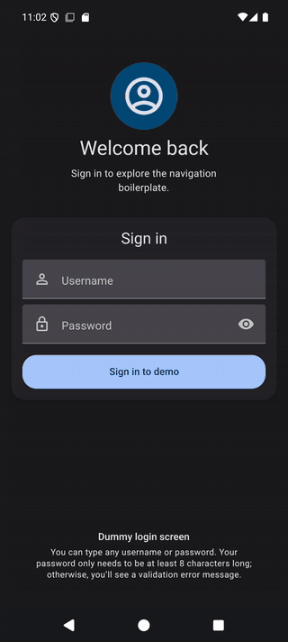

# React Native drawer + tab boilerplate



A practical React Native **0.87.1** starting point for apps that need an auth gate, a drawer, tabs, forms, and durable local state without rebuilding that foundation from scratch.

## Why this exists

Most mobile apps begin with the same wiring: safe areas, nested navigation, theme support, validated forms, and sensible persistence boundaries. This project packages those decisions into a small, typed reference app so a team can spend its first day on product work instead of setup work.

## What it includes

- Separate signed-out and signed-in navigation trees: auth → drawer → tabs → native stacks.
- Responsive light and dark themes across screens, navigation, and Paper controls.
- Reusable React Hook Form fields for text, money, select, checkbox, radio, date, and time values.
- A component gallery with currency, relative-date, and validation examples.
- Redux Toolkit state with Keychain/Keystore demo sessions and allowlisted MMKV profile persistence.
- Typed navigation, `@app/...` imports, and focused Jest checks.

## Built to adopt and customize

The project is deliberately conventional: feature folders, small reusable components, typed boundaries, and an [architecture guide](ARCHITECTURE.md). That makes it an effective starting point for people and coding agents alike. Clone it, describe the screen, flow, or visual system you need to your preferred GPT-based coding assistant, and it has clear seams to work with. As with any generated change, review it and run the checks before shipping.

It is easier than starting from a blank app because the navigation, form adapters, theme wiring, safe-area behavior, and secure-storage boundaries are already connected and demonstrated—not merely listed as dependencies.

## Rename it for your app

For a display-name-only change, update these three values together:

1. `app.json` (`name` and `displayName`)
2. `android/app/src/main/res/values/strings.xml` (`app_name`)
3. `ios/rn_drawertabnav_boilerplate/Info.plist` (`CFBundleDisplayName`)

For a production app, also choose your own Android application ID and iOS bundle identifier before release. A renaming tool can automate native project renames, but inspect its output and rebuild both platforms afterward.

## Stack

React Native, TypeScript, React Navigation, React Native Paper, React Hook Form + Zod, Redux Toolkit, MMKV, Keychain/Keystore, Luxon, Jest, and the community date-time picker.

## Requirements

- Node 22.13+ (Node 24 is supported by the RN 0.87 package range)
- Android Studio / JDK 17 for Android
- Xcode and CocoaPods for iOS, on macOS

```text
npm install
npm run android
# macOS only: cd ios && pod install && cd .. && npm run ios
```

## Verification

```text
npm run typecheck
npm run lint
npm test
npm run format
```

Native Android and iOS builds remain necessary after changing a native dependency.

### Windows: rebuilding after a restart

This project uses temporary `SUBST` drive mappings to keep React Native CMake
paths short enough for Windows. They disappear after a restart. From the project
root, restore them before an Android build:

```powershell
$project = (Get-Location).Path
subst G: "$project\node_modules\react-native-gesture-handler"
subst S: "$project\node_modules\react-native-safe-area-context"
subst T: "$project\node_modules\react-native-screens"
subst R: "$project\android\app\.cxx"
$env:RN_CMAKE_STAGING_DIRECTORY = 'R:\'
$env:RN_GESTURE_HANDLER_CMAKE_SOURCE_DIRECTORY = 'G:'
$env:RN_SAFE_AREA_CMAKE_SOURCE_DIRECTORY = 'S:'
$env:RN_SCREENS_CMAKE_SOURCE_DIRECTORY = 'T:'
npm run android
```

The mappings are local and temporary; rerun this block after the next restart.

## Important boundaries

- `demoAuthApi` is intentionally not real authentication. Replace it with a network client before shipping.
- Passwords and access tokens never enter Redux or MMKV. The demo token is stored through `react-native-keychain`; only a small display profile is persisted in MMKV.
- Date/time uses the maintained community native picker behind Paper-styled fields. It follows each platform's native picker UX.
- The scoped icon package autolinks on Android/iOS. Do not restore the legacy list of manually copied font files from the old project.

See [ARCHITECTURE.md](ARCHITECTURE.md) for component, form, navigation, and state conventions.
